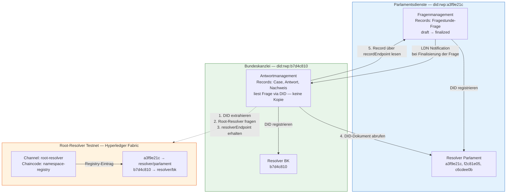
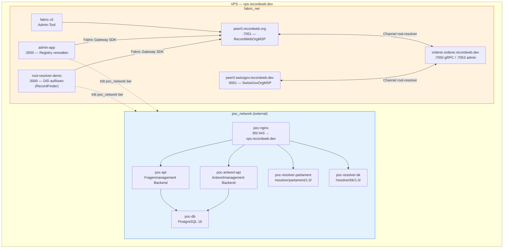
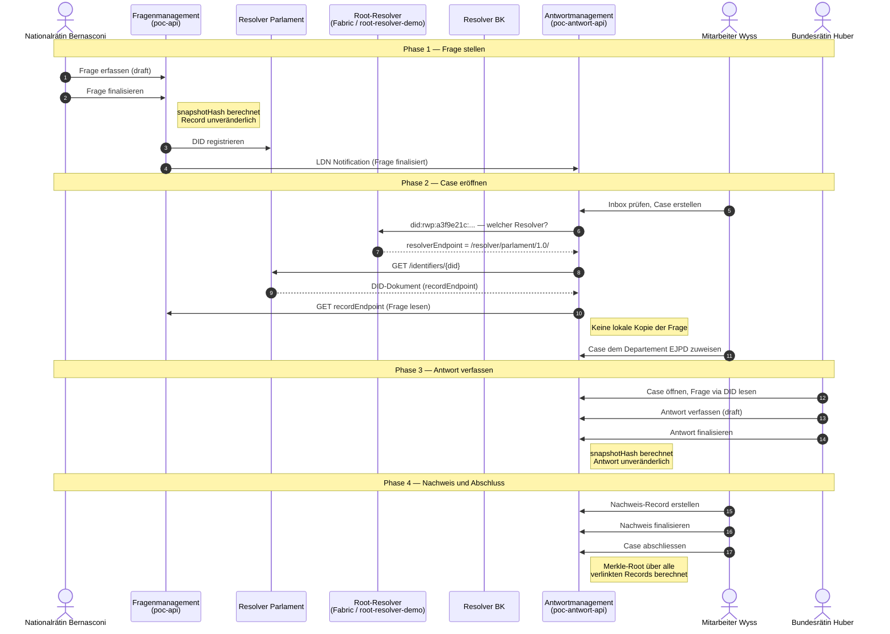

# RecordWeb PoC — Fragestunde

## Übersicht

Dieser Proof of Concept demonstriert RecordWeb am Beispiel der **parlamentarischen Fragestunde** des Schweizer Parlaments. Er zeigt, wie zwei institutionell getrennte Systeme — das Fragenmanagement der Parlamentsdienste und das Antwortmanagement des Bundesrats — Records über `did:rwp` identifizieren, über Linked Data Notifications (LDN) miteinander kommunizieren und Nanopublications zur öffentlichen Entdeckbarkeit nutzen können. 

Der PoC demonstriert bewusst keine vollständige Produktionsimplementierung. Er zeigt den **konzeptionellen Kern von RecordWeb**: ein Record entsteht dort, wo er hingehört, bleibt dort, und wird von anderen Systemen via DID gelesen — ohne Kopie, ohne Datenmigration, ohne zentrales Repository.

Der PoC dient einzig der Demonstration von RecordWeb. Er ist stark vereinfacht und nicht mit den beteiligten Parteien abgestimmt. **Der PoC ist somit ein fiktiver Demonstrator mit einem minimalen realen Bezug**. 

---

## Architekturskizze

## Szenario

### Beteiligte Akteure
| Akteur | Rolle | DID |
|---|---|---|
| Nationalrätin Maria Bernasconi | Parlamentarierin (persönlicher Namespace) | `did:rwp:f2c81e05:self` |
| Nationalrat Thomas Frei | Parlamentarier | `did:rwp:c6cdee0b:self` |
| Mitarbeiter Daniel Wyss | Sachbearbeiter Bundeskanzlei | `did:rwp:b7d4c810:users/daniel-wyss` |
| Bundesrätin Sandra Huber | Departementsvorsteherin EJPD | `did:rwp:b7d4c810:users/sandra-huber` |
| Journalist Lukas Meier | Medienschaffender, Beobachter (persönlicher Namespace) | `did:rwp:9e4a730b:self` |
| RWP-Node Bundeskanzlei | Institutionelles System | `did:rwp:b7d4c810:system/rwp-node` |
| RWP-Node Parlamentsdienste | Institutionelles System | `did:rwp:a3f9e21c:system/rwp-node` |

### Systemübersicht

┌─────────────────────────────────────────────────┐  
│ FRAGENMANAGEMENT (Parlamentsdienste)            │  
│ did:rwp:a3f9e21c:system/rwp-node                │  
│                                                 │  
│ Records: Fragestunde-Frage                      │  
│ Notify via: LDN → Antwortmanagement             │  
│ Discovery: Nanopub → Öffentlichkeit             │  
└──────────────────────┬──────────────────────────┘  
                       │ LDN Notification (bei Finalisierung)  
                       ▼  
┌─────────────────────────────────────────────────┐  
│ ANTWORTMANAGEMENT (Bundeskanzlei)               │  
│ did:rwp:b7d4c810:system/rwp-node                │  
│                                                 │  
│ Records: Fragestunde-Case, Antwort, Nachweis    │  
│ Liest Frage via DID (keine lokale Kopie!)       │  
│ Nanopub → Journalist abonniert                  │  
└──────────────────────┬──────────────────────────┘  
                       │ Nanopub (bei Case-Abschluss)  
                       ▼  
┌─────────────────────────────────────────────────┐  
│ NANOPUB-FEDERATION                              │  
│ Öffentliche Entdeckbarkeit                      │  
│ Journalist Lukas Meier abonniert Cases          │  
└──────────────────────┬──────────────────────────┘  

---

## Prozessablauf

### Phase 1 — Frage stellen (Fragenmanagement)

1. **Nationalrätin Bernasconi** (alternativ Thomas Frei) loggt sich im Fragenmanagement ein (Test-User-Login).
2. Sie wählt die **Session** (z. B. Herbstsession 2026).
3. Sie schreibt ihre **Frage** in ein Textfeld (max. 500 Zeichen).
4. Sie kann die Frage als **Draft** speichern und weiterbearbeiten.
5. Wenn sie sicher ist, **finalisiert** sie die Frage — analog zum «Speichern unter → .rwp».
   - Die Frage ist ab diesem Moment unveränderlich.
   - Der RWP-Node der Parlamentsdienste berechnet den `snapshotHash`.
   - Es wird automatisch eine **LDN-Notification** an die Inbox des Antwortmanagements gesendet.
   - Parallel wird eine **Nanopublication** in der Nanopub-Federation publiziert.

**Record: Fragestunde-Frage**  
Typ: `did:rwp:a3f9e21c:schema:fragestunde-frage`  
Zustand: `draft` → `finalized`

### Phase 2 — Case eröffnen (Antwortmanagement)

6. **Mitarbeiter Wyss** sieht die neue Notification in der Antwortmanagement-Inbox.
7. Er liest den Frage-Record **via DID** direkt aus dem Fragenmanagement — keine lokale Kopie.
8. Er erstellt einen **Case-Record** (`Fragestunde-Case`), der die Frage via DID verlinkt.
9. Er weist den Case dem **Departement** zu (z.B. EJPD).

### Phase 3 — Antwort verfassen (Antwortmanagement)

10. **Bundesrätin Huber** sieht alle Cases ihres Departements.
11. Sie öffnet den Case, liest die Frage (via DID-Auflösung), und verfasst ihre **Antwort** (max. 500 Zeichen).
12. Sie kann die Antwort als **Draft** im Case speichern.
13. Wenn bereit, **finalisiert** sie die Antwort.
    - Die Antwort ist ab diesem Moment unveränderlich und im Case verlinkt.

### Phase 4 — Nachweis und Case-Abschluss

14. Nach der Vortragung im Parlament erstellt Wyss einen **Nachweis-Record**: Bestätigung, dass die Antwort vorgetragen wurde.
15. Erst wenn dieser Nachweis-Record **finalisiert** ist, lässt sich der Case **abschliessen**.
16. Beim Case-Abschluss wird der **Merkle-Root** berechnet (über alle verlinkten Records).
17. Eine finale **Nanopublication** wird publiziert — Journalist Meier erhält eine Notification.

### Phase 5 — Solid Wallet (optional, Parlamentarierin)

18. Bernasconi kann die finalisierte Frage und die erhaltene Antwort in ihr **Solid Pod** verlinken — als persönlicher `Fragestunden-Case` in ihrem eigenen Namensraum. Keine Inhaltskopie — nur kryptographisch gesicherte Pointer auf die Records.

### Implementierungsstand

Das **Fragenmanagement** deckt Phase 1 sowie die Solid-Pod-Verlinkung aus Phase 5 ab.

Das **Antwortmanagement** deckt Login über den Resolver der Bundeskanzlei, die
LDN-Inbox (Phase 1 Notify), das **Case-Konzept** (Phase 2/3, RWP `CaseRecord`,
Kapitel 8) sowie den Antwort-Lebenszyklus (Draft → Finalized inkl. Versionierung) ab.
Ein Case verlinkt Frage (`trigger`, Hard Link) und Antwort (`result`, Hard Link) gemäss
RWP Annex A.2; solange die Antwort noch Draft ist, hält eine PoC-Erweiterung
(`workingLinks`, nicht Teil des normativen Schemas) den entsprechenden Soft Link. Die
Frage selbst wird dabei nicht kopiert, sondern beim Anzeigen jeweils per DID beim
Fragenmanagement aufgelöst. Der Case kennt kein eigenes „Bearbeiten“ — nur die
Verlinkung wird nachgeführt (automatisch bei Antwort-Finalisierung) und der Case selbst
wird abschliessend finalisiert, sobald keine offenen Soft Links mehr bestehen. Der
**Nachweis-Record** und die **Departements-Zuweisung** (Phase 4, als zusätzliches
`result`- bzw. `process`-Element vorgesehen) sind noch nicht implementiert. Ebenfalls
noch nicht abgedeckt: Korrektur/Neuversionierung eines bereits finalisierten Case,
wenn seine verlinkte Antwort nachträglich neu versioniert wird — der bestehende
Hard Link im Case bleibt dann auf den ursprünglichen (jetzt u.U. überholten)
Snapshot-Hash verweisen.

---

## Technische Grundlage

### Verwendete Standards

| Standard | Rolle im PoC |
|---|---|
| `did:rwp` | Identität aller Records, Akteure und Systeme |
| RWP v0.1 | Record-Struktur, Snapshot-Hashing, State-Maschine, Case-Merkle-Root |
| W3C LDN | Notify-Mechanismus: Fragenmanagement → Antwortmanagement |
| Nanopublications | Öffentliche Entdeckbarkeit, Journalist-Subscription |
| W3C PROV-O | Provenance-Serialisierung der Finalisierungsakte |
| Solid (LWS WG) | Solid Pod für Parlamentarierin (optional, Phase 5) |
| JSON Schema 2020-12 | Schema-Validierung der Record-Payloads |
| RFC 8785 (JCS) | Kanonische JSON-Serialisierung für Hash-Berechnung |

### Exkurs: Nostr und content-addressed Identity

Nostr identifiziert Events durch ihren SHA-256-Hash direkt — die ID *ist* der Hash. Das ist konzeptionell verwandt mit RecordWebs `snapshotHash`, unterscheidet sich aber: in RecordWeb ist der Hash der *Snapshot*, nicht der Record selbst. Der Record hat eine stabile DID, die über alle Versionen konstant bleibt. Ein Nostr-Event entspricht am ehesten einem einzelnen finalisierten Snapshot. Für RecordWeb wäre eine Nostr-ähnliche Adressierbarkeit denkbar als *alias* — `did:rwp:a3f9e21c:records:{snapshotHash}` — als direkt aufzulösende Adresse für einen spezifischen Snapshot, ergänzend zur stabilen DID. Dies ist eine offene Designfrage für RWP v1.0.

---

## Record-Typen und Schemas

Alle Schema-Definitionen liegen unter `schemas/`. Beispiel-Records liegen unter `schemas/examples/`.

| Record-Typ | Schema-Datei | Beschreibung |
|---|---|---|
| `fragestunde-frage` | `schemas/fragestunde-frage.schema.json` | Die Frage eines Parlamentariers |
| `fragestunde-antwort` | `schemas/fragestunde-antwort.schema.json` | Die Antwort des Bundesrats |
| `fragestunde-case` | `schemas/fragestunde-case.schema.json` | Case im Antwortmanagement |
| `fragestunde-nachweis` | `schemas/fragestunde-nachweis.schema.json` | Nachweis der Vortragung |

---

## Repository-Struktur

poc-fragestunde/  
│  
├── README.md ← Dieses Dokument  
│  
├── schemas/ ← JSON-Schema-Definitionen (SchemaRecords)  
│ ├── fragestunde-frage.schema.json  
│ ├── fragestunde-antwort.schema.json  
│ ├── fragestunde-case.schema.json  
│ ├── fragestunde-nachweis.schema.json  
│ └── examples/ ← Beispiel-Records (Mock-Daten)  
│   ├── frage-bernasconi-hs2026.json  
│   ├── case-ejpd-hs2026.json  
│   ├── antwort-huber-hs2026.json  
│   ├── nachweis-vortrag-hs2026.json  
│   ├── nanopub-frage.ttl  
│   ├── nanopub-case-abschluss.ttl  
│   └── ldn-notification.json  
│  
├── apps/  
│ ├── fragenmanagement/  
│ │ ├── backend/ ← Express-API (Records, DID, Swagger)  
│ │ └── frontend/fragenmanagement.html ← Single-file HTML-App  
│ ├── antwortmanagement/  
│ │ ├── backend/ ← Express-API (Records, DID, Swagger)  
│ │ └── frontend/antwortmanagement.html ← Single-file HTML-App  
│ └── resolver/ ← Mini-DID-Resolver (je Instanz pro Organisation)  
│  
└── viewer/  
  └── rw-viewer.html ← Record-Viewer (liest Beispiel-Records)  

---

## Scope des PoC

### Im Scope

- Record-Lebenszyklus (Draft → Finalized) mit State-Maschine
- DID-basierte Identität (`did:rwp`) für Records und Akteure, 
  aufgelöst über einen echten, opaquen DID-Resolver (siehe 
  `rwp-resolver`)
- Cross-System-Record-Referenz: Antwortmanagement liest die Frage 
  via DID direkt aus dem Fragenmanagement, keine lokale Kopie
- Echte LDN-Notification zwischen Fragenmanagement und 
  Antwortmanagement (Minimalimplementierung, CORS-basiert)
- Echte Nanopublication bei Finalisierung und Case-Abschluss, 
  publiziert über einen dedizierten Service (siehe 
  `rwp-nanopub-service`)
- Case-Merkle-Root, berechnet gemäss RWP-Spezifikation
- Solid-Pod-Integration für zwei unabhängige Anwendungsfälle 
  (siehe `rwp-solid-connector`):
  - Nationalrätin Bernasconi verlinkt Frage und Antwort in ihr 
    persönliches Solid Pod als Nachweis ihres parlamentarischen 
    Mandats
  - Journalist Meier speichert die Antwort in seinem eigenen 
    Solid-Server als unabhängige journalistische Dokumentation
- Kryptographische Snapshot-Hashes, real berechnet (nicht 
  Platzhalter)

### Ausserhalb des Scope

- Rechtsbindende Authentifizierung
- Vollständige, produktionsreife Zugriffskontrolle
- Verhalten bei Reorganisation, Merger oder Split von Namespaces 
  (siehe offene Designfragen in RWP, Kapitel 12)
- Kryptographische Authentifizierung der LDN-Notification/des sendenden 
  Systems selbst — bewusst weder in RWP/RWC noch in diesem PoC geregelt. 
  Notifications sind bewusst nicht-autoritative Hinweise ohne Inhalt ("da 
  ist was Neues"); jedes empfangende System löst den referenzierten Record 
  ohnehin selbst über die DID auf, siehe `INTERFACES.md`.

### Verwendete externe Services

Dieser PoC nutzt drei eigenständige, produktiv geplante 
Infrastruktur-Repositories, die unabhängig von diesem PoC 
weiterentwickelt werden und auch von zukünftigen PoCs genutzt 
werden können:

- [`rwp-resolver`](https://github.com/recordweb/rwp-resolver) — 
  DID-Auflösung
- [`rwp-nanopub-service`](https://github.com/recordweb/rwp-nanopub-service) — 
  Nanopublication-Publikation und Discovery
- [`rwp-solid-connector`](https://github.com/recordweb/rwp-solid-connector) — 
  Solid-Pod-Integration

---

## Bezug zu anderen PoCs

Dieses Repository folgt der PoC-Struktur von `recordweb/poc-*`. 

---

## Lizenz und Governance

Licensed under the W3C Software and Document License 
(https://www.w3.org/copyright/software-license-2023/).
